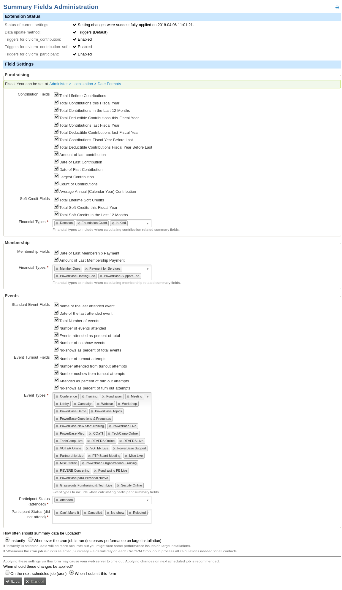

Summary Fields make it easier to search for contacts (or insert tokens) based
on a summary or other calculation of the contact's previous interactions.

For example, you can access a contact's total lifetime contribution amount,
last membership contribution date, number of attended events, total of last
year's deductible contributions, and more.

Summary Fields extends your CiviCRM data by creating a tab of fields that total
up and summarize the fields you choose.

Once you've completed set-up, a new tab will appear alongside the other tabs in
contact records showing the totals for each individual. The fields in this tab
will appears in Advanced Search and will be available as tokens for emails or
PDF merges.

Getting Started
-----------------

After installing the extension, you must configure it before any summary fields
are calculated.

You can configure the extension by going to `Adminster -> Customize Data and
Screens -> Summary Fields.`

Choose the fields you want to enable. Every field you enable will slow down the
performance of your database just a little, so only enable fields you really
need. You can always come back and enable additional fields later.

In addition, you can configure how Summary Fields works. For example, you can
choose which financial types should be included when calculating contribution
amounts. And you can dedide which participant status types should be considered
"attended" and which should be a considered a "no-show".

Want more summary fields?
------------------

Do you want more summary fields? Check out [Joinery's More Summary
Fields](https://github.com/twomice/com.joineryhq.jsumfields) for an extension
providing yet more fields.

Want *still more fields*?

You can write your own extension. Learn how in the document **DEVELOPERS.md** in
the this extension.
